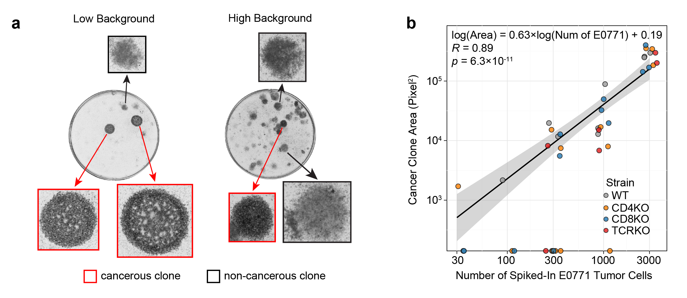

## Circulating tumor cell calibration for Clonogenic Assay

We used the clonogenic assay for CTC quantification, which was adapted from this [Nature Protocol](https://www.nature.com/nprot/journal/v1/n5/full/nprot.2006.339.html) paper.

**a**). Representative images of Clonogenic Assay with low and high background.

**b**). Scatter plot showing the correlation between the number of E0771 cells spiked in the extracted blood and clonogenic area (WT, n=11; CD4 KO, n=13; CD8 KO, n=11; TCR KO, n=6).

Pearson correlation coefficient (*R*) and the corresponding *P* value are shown in the plots. *P* value was determined by Student’s t-test.