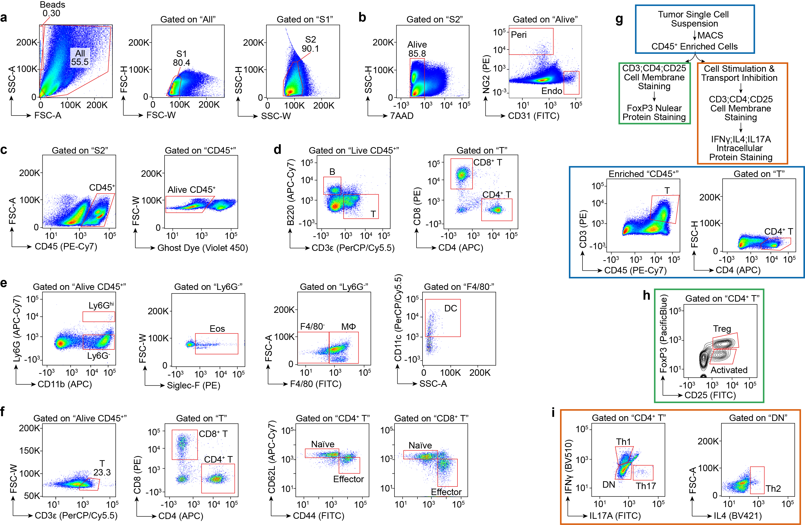

## Flow Panel Used in the Paper

The antibody information can be found in **nature21724_FlowPanel.pdf**.

The figure below shows the gating strategy.

**a-c)**. Gating strategy for live single cells (**a**), pericytes (Peri, 7AAD−NG2+), and endothelial cells (Endo, 7AAD−CD31+) (**b**), and live immune cells (GhostDye−CD45+) (**c**).
**d**). Gating strategy for CD4+ T cells, CD8+ T cells and B cells from (**c**).
**e**). Gating strategy for neutrophils, eosinophils, macrophages and dendritic cells from (**c**).
**f**). Gating strategy for naïve T cells and effector memory T cells from (**c**).
**g**). Flow chart showing preparation and gating of regulatory T cells (Treg) and T helper cells.
**h**). Gating strategy for Treg and activated CD4+ T cells from (**g**).
**i**). Gating strategy for Th1 (IFNγ+), Th2 (IL4+) and Th17 (IL17A+) from (**g**) (DN, double negative).
  