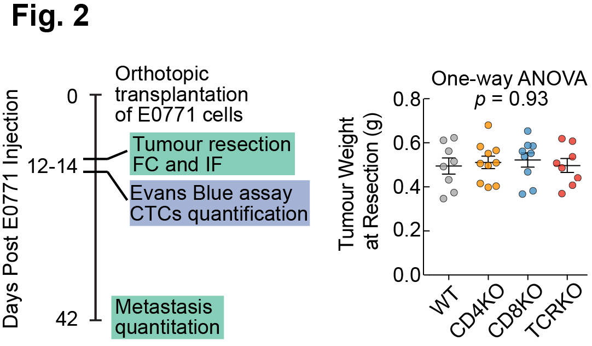
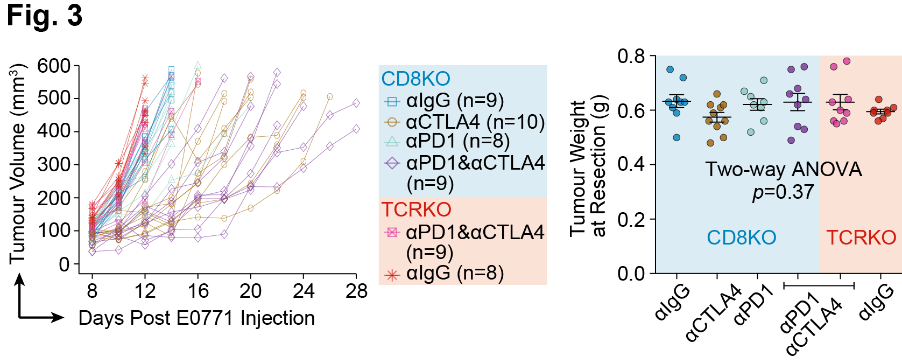

## Description of Texture Segmentation Algorithm

### Experimental Design

The texture segmentation algorithm is design to quantify **macro**metastasis. Since the murine tumors like E0771 are fast-growing, we resected the tumor when the size reached 500mm3, and waited 30 days to harvest the lung. Here is the experimental design for **Fig. 2**.

Another way to quantify the **macro**metastasis is India Ink assay, which was used in **Fig. 3**. In India Ink Assay, the nodules should not be too big. Otherwise the nodules will be fused and this can affect the quantification. Similar to the design in **Fig. 2**, we resected the tumor when the size reached 500mm3, but we terminated the experiment and quantified the number of lung metastasis nodules on **Day 28** post-E0771 injection.

In both sets of experiments, we keep the tumor sizes/weights similar (500mm3) in order to make the lung metastasis quantification fair. The source data for the tumor sizes/weights can be found in the online paper.

### Principle of Texture Segmentation Algorithm

Representative H&E staining showing the features of lung normal tissues, tumor metastasis, and background. Lung tissue has the highest entropy and the background has the lowest entropy.

### Steps involved in texture segmentation.

### Example Outputs

The `examples.m` will implement `TextureSegEntropy.m`, and analyze the four whole section scanning images (**9448_3_TCRKO.TIF**, **9713_2_CD8KO.TIF**, **9716_1_CD4KO.TIF**, **9943_5_WT.TIF**) provided.

The original images (**left**) and the texture segmented images (**right**) are shown below. The blackened areas are the tumor tissues.

### Acknowledgement

We thank the feedback provided by Zhoubing Xu and Guotai Wang on MATLAB code.

