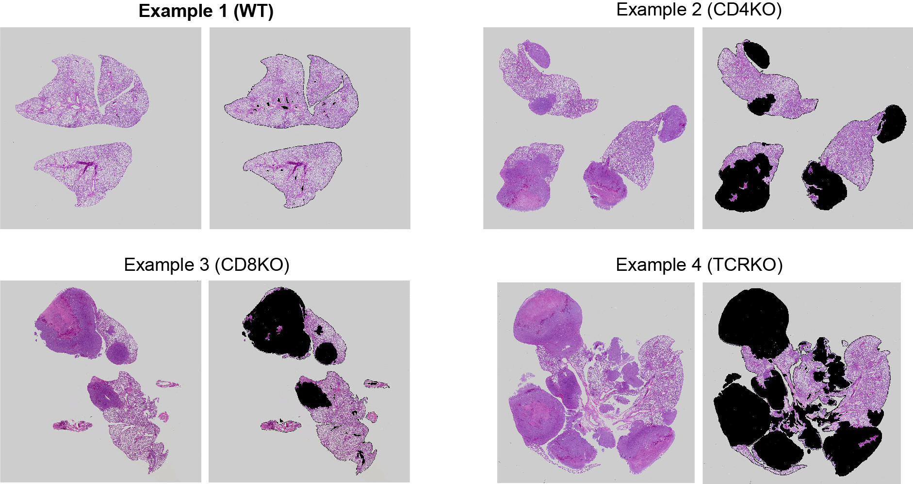

## Description of Texture Segmentation Algorithm

Representative H&E staining showing the features of lung normal tissues, tumor metastasis, and background. Lung tissue has the highest entropy and the background has the lowest entropy.

### Steps involved in texture segmentation.

### Example Outputs

The `examples.m` will implement `TextureSegEntropy.m`, and analyze the four whole section scanning images (**9448_3_TCRKO.TIF**, **9713_2_CD8KO.TIF**, **9716_1_CD4KO.TIF**, **9943_5_WT.TIF**) provided.

The original images (**left**) and the texture segmented images (**right**) are shown below. The blackened areas are the tumor tissues.

### Acknowledgement

We thank the feedback provided by Zhoubing Xu and Guotai Wang on MATLAB code.

