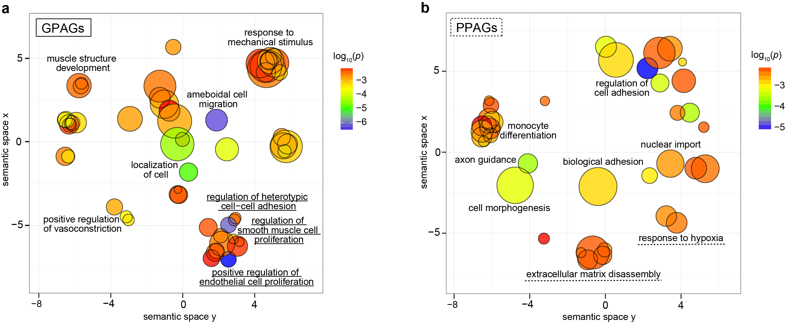

`REVIGO_GPAGs.Rmd` and `REVIGO_PPAGs.Rmd` are used to generate REVIGO plots.

The outputs of [KOBAS](http://kobas.cbi.pku.edu.cn/index.php) (`GPAGsDis.identify` and `PPAGsDis.identify`, see `vesselNormalization/data` folder) are downloaded. As stated in the extended figure legend, the pathways with *p* < 0.01 are selected for Venn Diagram and [REVIGO](http://revigo.irb.hr/) plot.

The custom codes attached (`REVIGO_GPAGs.Rmd` and `REVIGO_PPAGs.Rmd`) were used to generate high quality, vector-based plots. The outputs are shown below. This correspondes to **Supplementary Table 2**.

