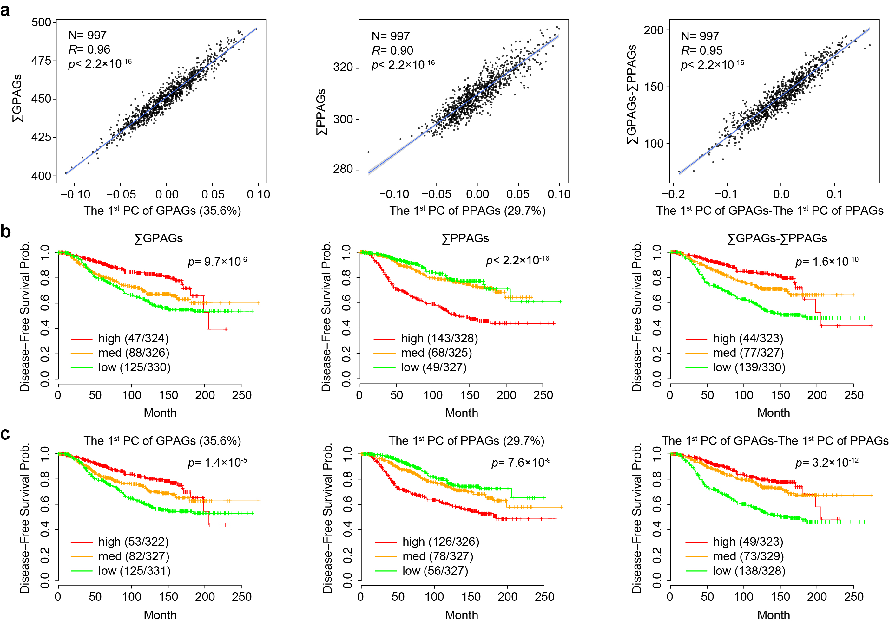

`PCA_Sum_Comparison.Rmd` is used to compare two approaches of generating GPAG/PPAG signature.

Before you run the code, you need to apply to the access to [METABRIC Dataset](https://ega-archive.org/dacs/EGAC00001000484).

As most biologists are not familiar with principal component analysis ([PCA](https://en.wikipedia.org/wiki/Principal_component_analysis)), we use a single metrics (∑GPAGs − ∑PPAGs) to indicate vessel normalization throughout the manuscript.

Here, we compare this single metrics with the 1st principal component. As is shown in the plot below, the single metrics has very high correlation with PCA approach.

